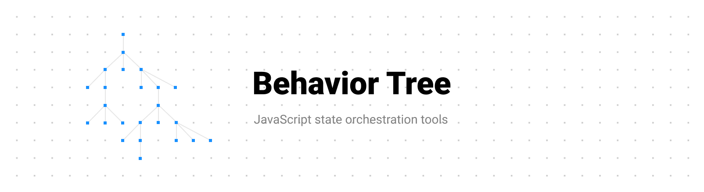

JavaScript/TypeScript implementation of [Behavior Trees](https://en.wikipedia.org/wiki/Behavior_tree).

📕 [Read the documentation](packages/core/README.md) to learn the API.

> **Note**: This software is in early development stage. It's not production ready. API may change.

## Behavior Tree Toolkit

- 🌲 [@btree/core](packages/core) - Framework agnostic behavior trees implementation
- ⚛ [@btree/react](packages/react) - Hooks and docs how to use BT with React

## Quick start

```sh
npm install @btree/core
```

```tsx
import {nodes} from '@btree/core'

const initialState = {
  isLoggedIn: false
}

const AuthBehavior = nodes.root('Auth behavior', () =>
  /* Selector runs child one by one until one of them succeeds */
  nodes.selector([
    /* Sequence runs child one by one and stops if any child return failure status */
    nodes.sequence([
      /* Condition node run logic checks on current state */
      nodes.condition('Is logged in', (state, props) => state.isLoggedIn),
      /* Action node is used for side effects and state modifications */
      nodes.action('Redirect to dashboard', (state, props) => {
        navigate('/dashboard')
      }),
    ]),
    nodes.sequence([
      nodes.action('Redirect to login page', () => {
        navigate('/login')
      }),
    ]),
  ])
)

// Create instance of tree
const authTree = AuthBehavior(initialState)

// Run tree logic
authTree.tick()

// You can also run it with props
authTree.tick({authKey: 'xyz'})
```

## Why?
Getting app features done is cool but what about future changes? As time passes, you will forgot how given feature works. Writing comments or docs is not something that developers have in mind all the time. This library will handle that for you.

With Behavior Tree notation all your code will be wrapped with nodes - that allows to visualize how it works. Check [/packages/react/example](/packages/react/example) for implementation of this logic.


